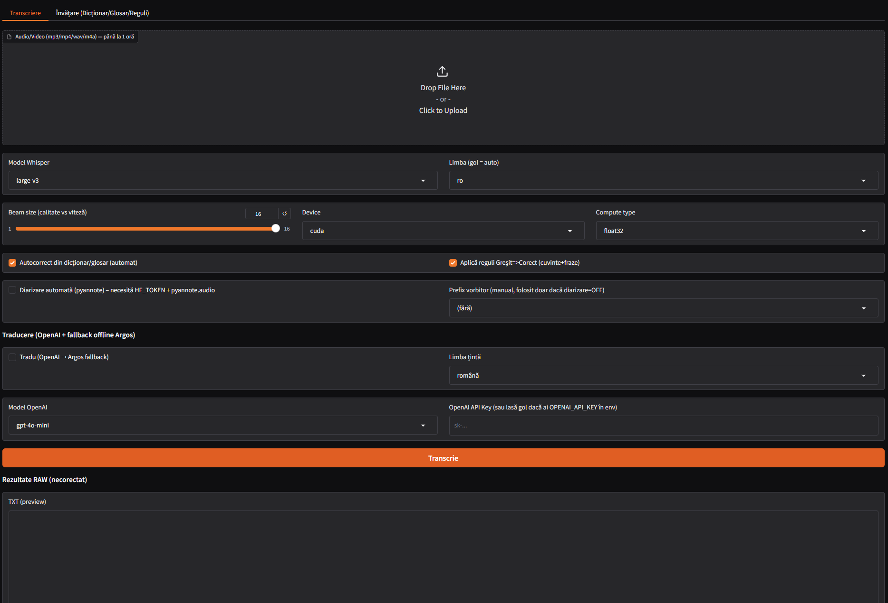

# 🎙 Whisper SRT GUI

## 📸 Interfața aplicației

<p align="center">
  
</p>

O aplicație de transcriere pregătită pentru producție, construită cu\
**faster-whisper** și **Gradio**, concepută pentru transcriere
audio/video precisă în **format TXT și SRT**, cu funcții avansate de
corectare a textului, diarizare a vorbitorilor și traducere.

**Interfața aplicației este complet în limba română 🇷🇴**

------------------------------------------------------------------------

## ✨ Prezentare generală

Whisper SRT GUI oferă:

-   🎧 Transcriere de înaltă acuratețe\
-   📄 Export în format TXT & SRT\
-   🧠 Corectare inteligentă a textului (glosar + motor de reguli)\
-   👥 Diarizare opțională a vorbitorilor (pyannote)\
-   🌍 Suport pentru traducere (OpenAI + alternativă offline Argos)\
-   ⚡ Procesare completă a fișierelor audio (fără trunchiere)\
-   🔁 Reducerea repetițiilor și filtrarea duplicatelor

------------------------------------------------------------------------

# 🚀 Funcționalități principale

## 🎧 Transcriere

-   Formate suportate: `.mp3`, `.wav`, `.m4a`, `.mp4`
-   Generează:
    -   `transcript_raw_*.txt`
    -   `transcript_raw_*.srt`
    -   `transcript_corrected_*.txt`
    -   `transcript_corrected_*.srt`
-   Suportă fișiere de până la **1 oră** (configurabil)

------------------------------------------------------------------------

## 🧠 Corectare text (Sistem de învățare)

-   Corectare pe bază de glosar (1 termen / linie)
-   Motor personalizat de reguli (`Greșit ⇒ Corect`)
-   Import dicționare prin `user_data/dictionaries`

------------------------------------------------------------------------

## 👥 Diarizare vorbitori (Opțional)

-   Bazată pe `pyannote.audio`
-   Necesită token Hugging Face (`HF_TOKEN`)
-   Etichetează automat segmentele (Vorbitor 1, Vorbitor 2 etc.)

------------------------------------------------------------------------

## 🌍 Traducere (Opțional)

### OpenAI (Cloud)

-   Necesită `OPENAI_API_KEY`

### Argos Translate (Offline)

-   Funcționează fără internet
-   Necesită instalarea pachetelor de limbă

------------------------------------------------------------------------

# 🔒 Garanția integrității audio

✔ Convertește automat fișierul în WAV (16kHz)\
✔ Folosește `vad_filter=False` (nu taie segmentele de voce)\
✔ Procesează întreaga durată a fișierului audio

Dacă audio are 10 minute → transcrierea reflectă 10 minute\
Dacă audio are 60 minute → transcrierea reflectă durata completă

------------------------------------------------------------------------

# 🖥 Cerințe de sistem

## Windows

-   Python 3.10+
-   FFmpeg + FFprobe adăugate în PATH
-   (Opțional) NVIDIA CUDA pentru accelerare GPU

## Linux (Ubuntu 22.04)

-   Python 3.10+
-   FFmpeg instalat prin apt
-   (Opțional) NVIDIA CUDA pentru accelerare GPU

------------------------------------------------------------------------

# 📦 Instalare

## Clonare repository

``` bash
git clone <repo_url>
cd whisper_srt_gui
```

## Windows

``` bat
python -m venv .venv
call .venv\Scripts\activate.bat
python -m pip install -U pip setuptools wheel
python -m pip install -r requirements.txt
```

## Linux (Ubuntu 22.04)

``` bash
sudo apt update
sudo apt install -y ffmpeg python3-venv python3-pip

python3 -m venv .venv
source .venv/bin/activate
python -m pip install -U pip setuptools wheel
python -m pip install -r requirements.txt
```

------------------------------------------------------------------------

# ▶️ Rulare aplicație

``` bash
python app.py
```

Acces local:

http://127.0.0.1:7860

------------------------------------------------------------------------

# 📁 Structura proiectului

    3app.py              # Aplicația principală Gradio
    corrections.py       # Glosar & motor de reguli
    requirements.txt     # Dependențe
    start.bat            # Lansator Windows
    start.sh             # Lansator Linux

    user_data/
      glossary.txt
      rules.txt
      dictionaries/
      outputs/

    tmp/                 # Procesare temporară WAV

------------------------------------------------------------------------

# 📜 Licență

Se recomandă licența MIT.
